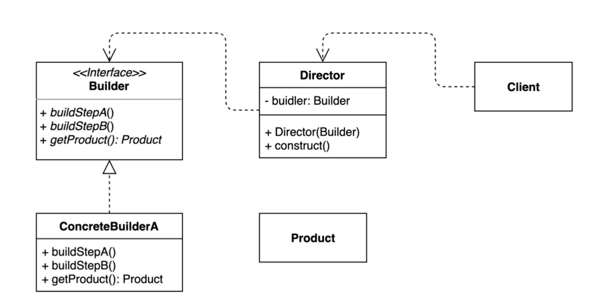
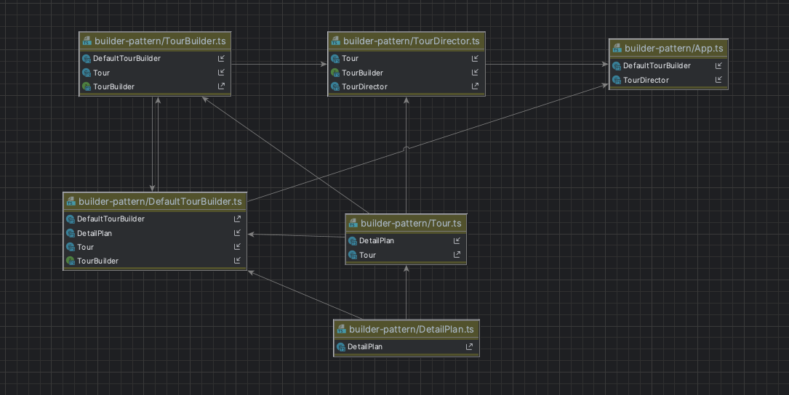

# Builder-pattern
> 빌더 패턴은 복잡한 객체를 생성하는 방법을 정의하는 클래스와 표현하는 방법을 정의하는 클래스를 별도로 분리하여,  
> 서로 다른 표현이라도 이를 생성할 수 있는 동일한 절차를 제공하는 패턴이다.




# Builder 패턴 장점 
- 객체 생성 시 여러 단계를 순차적으로 거칠 때, 이 단계의 순서를 결정해 두고 각 단계를 다양하게 구현 할 수 있도록 구현 할 수 있다. 
- 디렉터를 사용하면 객체 생성하는 부분을 숨길 수 있다.
- 생성해야할 인자가 많다면 builder를 통해 선택해서 생성 할 수 있다.
- 불안정한 객체를 생성하지 못하도록 방지한다.(builder() 함수를 호출해야함 완전한 객체를 생성 할 수 있다.)

# Builder 패턴 단점
- 디렉터 사용시 디렉터 와 빌더까지 인스턴스를 만들고 시작해야한다.
- 객체 생성의 복잡도가 올라간다.


# 실행

```bash
ts-node App.ts
```

# 부록
- 지금 까지 빌더 패턴을 구현해보았다. 각 언어마다 빌더 패턴을 쉽게 구현해 줄 수 있는 라이브러리가 존재하는데
java에서는 lombok이 대표적으로 사용되고 있고 현재는 필수 라이브러리로 자리잡고 있다.
- typescript 에서는 lombok만큼은 아니지만 구현되어 있는 라이브러리가 존재하며 
 [builder-pattern](https://www.npmjs.com/package/builder-pattern) 라이브러리를 사용한다.

```typescript
import { Builder } from 'builder-pattern';

 return Builder(StatisticsEmdDto)
   .emdKor(item.emdKor)
   .emdCd(item.emdCd)
   .count(item.count)
   .area(item.area)
   .build();

```