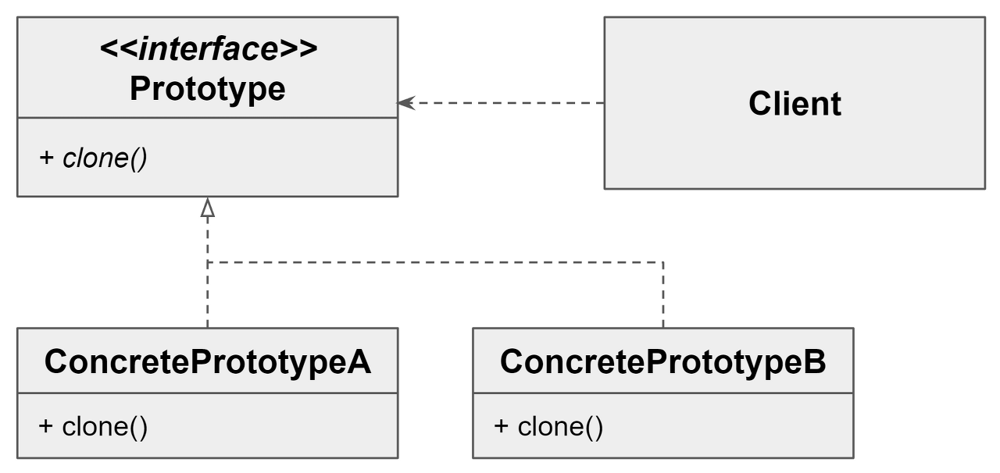
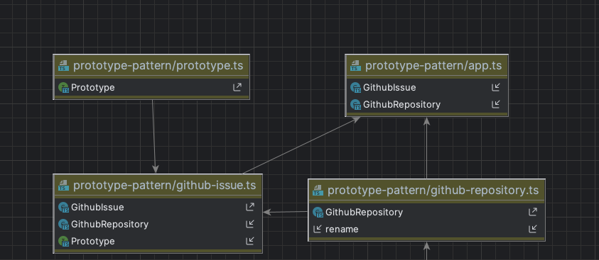

# Prototype-pattern
- 기존의 인스턴스를복제하여 새로운 인스턴스를 만드는 방법이다.
- 복제 기능을 갖추고 기존 인스턴스를 프로토타입으로 사용해 새 인스턴스를 만들 수 있다.



# prototype 장점
- 복잡한 객체를 만드는 과정을 숨길 수 있다.
- 기존 객체를 복제하는 과정이 새 인스턴스를 만드는 것보다 비용(시간, 메모리)적인 면에서 효율적일 수도 있다.
- 추상적인 타입을 리턴할 수 있다.(clone 에서 반환하는 타입이 clone을 정의한 클래스와 반드시 동일할 필요는 없다)

# prototype 단점
- 복제한 객체를 만드는 과정 자체가 복잡할 수도 있다(순환 참조가 있는 경우)

# 실행

```bash
ts-node app.ts
```
