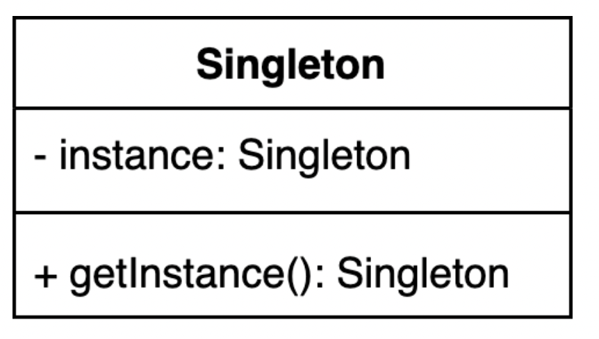

# 싱글톤 패턴
> 하나의 클래스에 **오직 하나의 인스턴스**만 생성하도록 보장하는 패턴 입니다. \
> 싱글톤 패턴은 많은 소프트웨어 시스템에 사용되고 있으며, 객체 생성과 초기화 작업에 드는 비용을 줄이면서도 전체 시스템의 일관성을 유지 할 수 있는 장점이 있다.



# 싱글톤 패턴 장점
- 싱글톤 패턴을 사용하면 여러 개의 객체를 생성하는 것보다 메모리 사용량을 줄일 수 있다. 
- 초기 객체 생성과 초기화 작업에 드는 시간과 비용을 절약할 수 있다.
- 싱글톤 패턴 사용시 전역 변수를 사용하지 않고도 어디서든지 해당 객체에 접근 할 수 있으므로 전체 시스템의 일괄성을 유지하기 쉽다.

# 싱글톤 패턴 단점
- 싱글톤 패턴 사용 시 객체의 라이프사이클이 복잡해지고, 멀티스레드 환경에서 동기화 문제가 발생 할 수 있다.(동시성)
- TDD 개발 시 단위 테스트는 테스트가 서로 독립적이어야 하며 테스트를 어떤 순서로도 실행할 수 있어야 한다. 하지만 싱글톤 패턴은 미리 생성된 하나의 인스턴스를 기반으로 구현하는 패턴이므로 각 테스트마다 독립겆깅ㄴ 인스턴스를 만들기가 어렵다.


## 실행
```bash
ts-node singleton.ts
```
