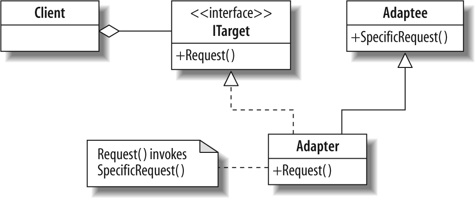
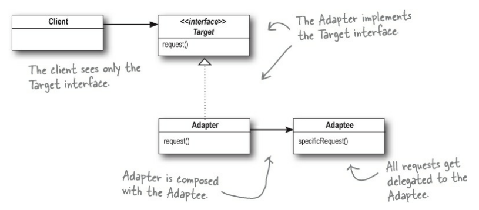

# adapter-pattern
- 특정 클래스 인터페이스를 클라이언트에서 요구하는 다른 인터페이스로 변환합니다.
- 인터페이스가 호환되지 않아 같이 쓸 수 없었던 클래스를 사용할 수 있게 도와줍니다.

# adapter 종류
## class adapter

- 클래스 어댑터는 target과 adaptee를 다중 상속으로 구현 한다. 
- 클래스 어댑터는 타깃과 어댑티 모두 서브 클래스로 만들어서 사용한다.
- 클래스 어댑터는 다중 상속을 지원하는 언어에서만 사용 할 수 있습니다.


## object adapter

- 클래스 어댑터와 다르게 객체 어뎁터는 합성을 사용한다.


# adapter 장점
- adapter 패턴은 코드 변경 시 기존 코드를 변경하지 않아도 된다.
- 기존 코드를 변경하지 않기 때문에 클래스 재활용성을 증가 시킬 수 있다.

# adapter 단점
- 구성 요소를 위해 클래스를 증가시켜야 하기 때문에 복잡도가 증가한다.
- 클래스 adapter의 경우 상속을 사용하기 때문에 유연하지 못하다.
- 객체 adapter의 경우 대부분의 코드를 다시 작성해야 하기 때문에 효율적이지 못하다.

# 실행

``` bash
ts-node app.ts
```