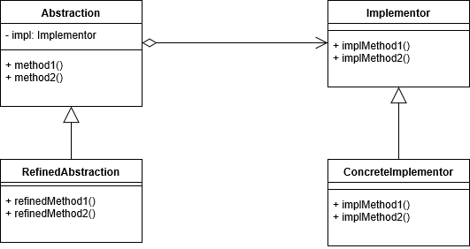

# bridge-pattern

- 구현과 더불어 추상화 부분까지 변경해야 할때 사용한다.
- 추상화된 부분과 구현 부분을 서로 다른 클래스 계층구조로 분리해서 그 둘을 모두 변경할 수 있다.

# bridge-pattern 장점
- 구현과 인터페이스를 완전히 결합하지 않았기에 구현과 추상화 부분을 분리 할 수 있다.
- 추상화된 부분과 실제 구현 부분을 독립적으로 확장 할 수 있다.
- 추상화 부분을 구현한 구상 클래스가 바뀌어도 클라이언트에는 영향을 끼치지 않는다.

# bridge-pattern 활용
- 여러 플랫폼에서 사용해야 하는 그래픽스와 윈도우 처리 시스템에서 유용하다.
- 인터페이스와 실제 구현할 부분을 서로 다른 방식으로 변경해야 할 때 유용하다.

# bridge-pattern 단점
- 디자인이 복잡해진다는 단점이 있다.

# bridge-pattern 과 adapter-pattern 차이
- 두 패턴 모두 interface의 detail을 감추고자하며 구조적인 차이는 없다.
- 어댑터는 어떤 클래스의 인터페이스가 다른 코드에서 기대하는 것과 다를때 어댑터를 중간에 두어 맞추는것에 의미가 있다.
- 브릿지 패턴은 추상과 구현을 분리하는 것에 의미가 있다.


# 실행
```bash
ts-node app.ts
```
