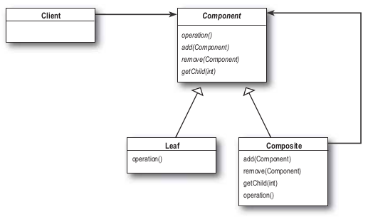
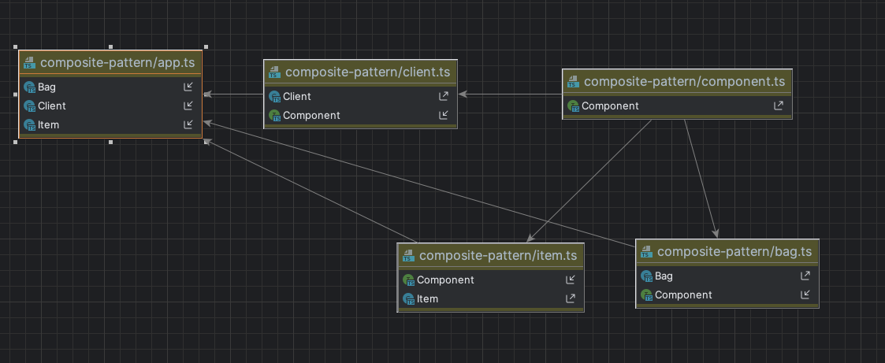

# composite-pattern
- 객체를 트리구조로 구성해서 부분-전체 계층 구조(part-whole hierarchy)를 구현한다. 컴포지트 패턴을 사용하면 클라이언트에서 개별 객체와 복합 객체를 똑같은 방법으로 다룰 수 있다.

> 부분-전체 계층 구조(part-whole hierarchy)이란
> 부분들이 계층을 이루고 있지만 모둔 부분을 묶어서 전체로 다룰 수 있는 구조를 뜻한다.


- client 
  - component 인터페이스를 사용해서 복합 개체 내의 객체들을 조작 할 수 있다.
- component
  - 복합 객체 내에 들어 있는 모든 객체의 인터페이스를 정의한다.(복합노드와 잎에 관한 메서드 까지 정의)
- leaf
  - 원소의 행동을 정의합니다. composite에서 지원하는 기능을 구현
- composite
  - 자식이 있는 구성 요소의 행동을 정의하고 자식 구성 요소를 저장하는 역할을한다.

# composite-pattern 장점
- 복잡한 트리 구조를 편리하게 사용 할 수 있다.
- 다형성과 재귀를 활용 할 수 있다.
- 클라이언트 코드를 변경하지 않고 새로운 element type을 추가 할 수 있다.

# composite-pattern 단점
- 트리를 만들어야 하기 때문에(공통된 인터페이스를 정의해야 하기 때문에) 지나치게 일반화 해야 하는 경우도 생길 수도 있다.


# 실행

```bash
ts-node app.ts
```